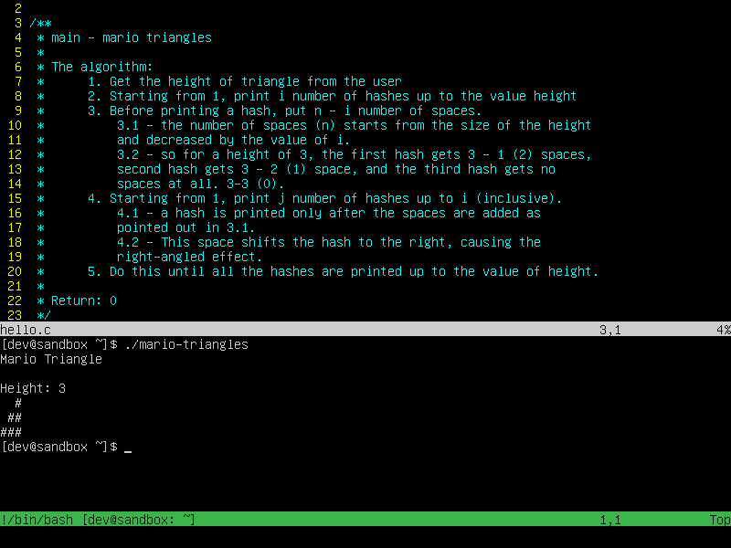

# more-vim

Up your ViM game with "more-vim"... more power.

This program aims to help you quickly set and unset cool Vim features.

These features include

- A colorscheme of your choice... hybrid_material by default
  - you can edit the `.vimrc` file in your directory if you prefer another
- Better syntax highlighting
- Better indentations
  - Equivalent to four spaces by default
- Remove trailing whitespaces with `:Trail` while in command mode
- Easier navigation
- Parenthesis matching
- `Ctrl + J` for in-Vim terminal (splits below)
  - You don't have to exit VIM to compile and run your programs.
  - You can do all this while in VIM
- use `:vsplit` to vertically split the VIM window and work on multiple files.
- `:vsplit <filename>` opens the file specified in the new window.
- use `Ctrl + W + <direction>` to change to different windows.
  - you can also press `Ctrl + W` multiple times to cycle through all opened windows

## How to install (Linux Environments)

1. Clone this repository: **git clone <https://github.com/nanafox/more-vim.git>**
2. Change directory into the folder. `cd more-vim`
3. One more time, get yourself into the `src` folder. `cd src/`
4. Run the `install.sh` script as root. `sudo bash install.sh`
   - you could as well, do a `chmod +x install.sh` and then `sudo ./install.sh`.
  both of these options work.
5. Once the installation is done... you'll see how to use the program.
It's a simple on or off argument you specify...

To turn it on, use `more-vim on`. That's all you need to do.

The opposite is true... `more-vim off`, turns the nice features off and gives you the normal,
default Vi/Vim feel.

## Contributing

Seen something that could be made better? I'm open to suggestions and improvements. :-)

## LICENSE

[MIT License](LICENSE)
